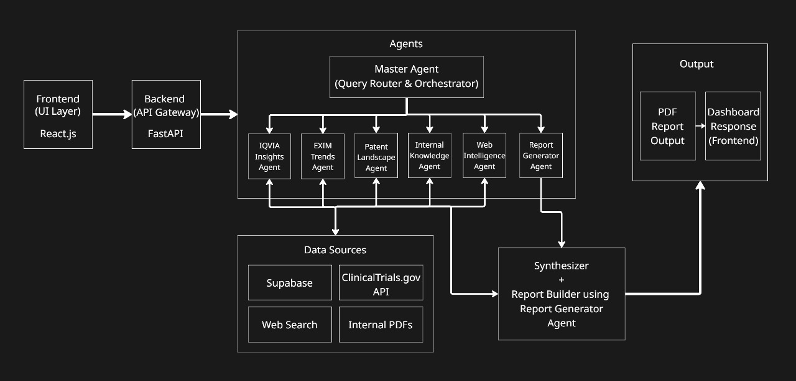

<p align="center">
  
</p>

# 🚀 Sanjaya AI — Agentic AI Platform for Pharmaceutical Innovation Discovery  
**End-to-End AI System for Molecule Assessment, Market Research, Patent Landscaping & Clinical Insights**

## 📌 Overview  
**Sanjaya AI** is an Agentic AI system built for a leading multinational generic pharmaceutical company striving to diversify into innovative, value-added healthcare products. Traditionally, identifying molecule repurposing opportunities requires 2–3 months of manual research. Sanjaya AI accelerates this through automated multi-agent orchestration, domain intelligence, and structured insight generation.

---

## 🎯 Problem Statement  
Discovering innovation opportunities for pharmaceutical molecules requires heavy, repetitive research across regulatory websites, scientific literature, clinical trials, market data, and patent databases. **Sanjaya AI** automates this research pipeline and significantly improves both speed and quality.

Sanjaya AI supports:

- Real-time querying from regulatory, scientific, clinical, and market databases  
- Summarizing journals, guidelines, clinical evidence, and competitive insights  
- Generating structured PDF/Excel reports   

---

## 🎯 Goal  
Build a multi-agent AI system where **Sanjaya AI (Master Agent)** coordinates several domain-specific Worker Agents to perform automated research and present integrated insights through an intuitive UI.

---

## 🧩 System Architecture


### **Frontend (React + Tailwind + Vite)**
- Chat-based interface for interacting with **Sanjaya AI**  
- Molecule query input and multi-step research flows  
- Table, chart, and downloadable PDF outputs  
- CSV upload support for internal knowledge ingestion via Supabase  

### **Backend (FastAPI + LangGraph)**
- Executes multi-agent workflows via LangGraph  
- Interfaces with OpenAI models through the SDK  
- Connects with regulatory, clinical, and patent APIs  
- Creates PDF/Excel reports  

### **Agent Framework (OpenAI SDK + LangGraph)**
- **Sanjaya AI (Master Agent)** orchestrates the conversation  
- Worker Agents handle domain tasks  
- Synthesized output is packaged into structured reports  

---
## ✨ Key Features of Sanjaya AI

### 🔹 1. Multi-Agent Orchestration
- Sanjaya AI (Master Agent) coordinates multiple domain-specific Worker Agents  
- Automatically breaks down research tasks and assigns them to specialized modules  
- Produces unified, synthesized insights with complete traceability  

### 🔹 2. Real-Time Data Intelligence
- Fetches live insights from regulatory sites, clinical trial databases, patents, and scientific publications  
- Performs web intelligence search for guidelines, journals, and market updates  
- Supports internal data ingestion through Supabase storage  

### 🔹 3. Comprehensive Molecule Evaluation
- Identifies unmet medical needs  
- Analyzes market trends, volumes, CAGRs, and competitors  
- Shows clinical pipeline maturity  
- Detects patent barriers and freedom-to-operate status  

### 🔹 4. Automated Report Generation
- Generates PDF and Excel reports with tables, charts, and summaries  
- Stores reports in Supabase for secure archival  
- Provides downloadable links directly in the UI  

### 🔹 5. Modern & Interactive UI
- Chat-style interface built with React + Tailwind CSS + Vite  
- Allows users to ask natural language questions  
- Displays results as cards, charts, tables, timelines, and downloadable files  

### 🔹 6. Modular & Extensible Architecture
- Each agent works independently and can be extended with new tools or data sources  
- Backed by FastAPI for seamless integration and API expansion  
- LangGraph enables building complex agent workflows visually and logically  

### 🔹 7. Internal Document Intelligence
- Summarizes internal strategy decks, PDFs, MINS documents, and CSV datasets  
- Creates cross-comparisons between internal & public data  
- Helps validate commercial and clinical feasibility  

### 🔹 8. End-to-End Innovation Story Generation
- From molecule → unmet need → trials → patents → market → opportunity  
- Produces a complete “innovation concept” narrative in minutes  
- Ideal for R&D, medical affairs, commercial strategy, and product lifecycle teams  
---
## 🧠 Agent Roles

### **1. Sanjaya AI — Master Agent**
```yaml
Purpose: Orchestrate conversation & research workflows
Tools:
  - 🧭 LangGraph (workflow orchestration)
  - 🧠 OpenAI SDK (LLM reasoning)
  - 🔗 FastAPI (backend orchestration)
Output:
  - Decomposed subtasks
  - Synthesized summaries with references
  - Formatted reports (PDF/Excel)
```
---

## 🛠 Worker Agents


### **IQVIA Insights Agent**
```yaml
Purpose: Market intelligence & commercial analysis
Tools:
  - 📊 IQVIA dataset connectors
  - 📈 Time-series & CAGR calculators
  - 📑 Data visualization (charts/tables)
Output:
  - Market size tables
  - Sales & volume trend charts
  - Competitive landscape summary
```
---
### **EXIM Trends Agent**
```yaml
Purpose: Global trade & sourcing intelligence
Tools:
  - 📦 EXIM / trade data APIs
  - 🗺️ Country-level aggregation
  - 📉 Trend analysis utilities
Output:
  - Import/export volume tables
  - Country dependency & sourcing insights
  - Trade trend charts
```
---
### **Patent Landscape Agent**
```yaml
Purpose: IP scanning & freedom-to-operate checks
Tools:
  - 🏛️ USPTO / WIPO / EPO API scrapers
  - 🔎 Patent text extraction & parsing
  - 🗓️ Expiry timeline calculators
Output:
  - Patent status tables
  - Filing heatmaps by jurisdiction
  - Relevant patent PDF extracts
```
---
### **Clinical Trials Agent**
```yaml
Purpose: Clinical pipeline & trial landscape analysis
Tools:
  - 🏥 ClinicalTrials.gov / WHO ICTRP connectors
  - 🧾 Trial metadata parsers
  - 📊 Phase-distribution summarizers
Output:
  - Active trials table
  - Sponsor & phase distribution charts
  - Trial status and eligibility summaries
```
---
### **Internal Knowledge Agent**
```yaml
Purpose: Ingest & summarize company internal docs
Tools:
  - 💾 Supabase storage + file access
  - 📄 PDF / CSV / DOCX parsers
  - 🧰 Vector store + embedding search
Output:
  - Evidence-backed internal summaries
  - Comparative tables vs external findings
  - Downloadable briefing PDFs
```
---
### **Web Intelligence Agent**
```yaml
Purpose: Real-time web & literature intelligence
Tools:
  - 🔎 Live web search (guidelines, news)
  - 📚 Journal article parsers / DOI fetchers
  - 🔗 Hyperlink & citation extractor
Output:
  - Hyperlinked evidence snippets
  - Quoted guideline & literature extracts
  - Web-sourced summary with links
```
---
### **Report Generator Agent**
```yaml
Purpose: Produce polished deliverables for archive & review
Tools:
  - 🖨️ PDF generator (HTML → PDF)
  - 📑 Excel/CSV exporters
  - 💾 Supabase archival uploader
Output:
  - Downloadable PDF / Excel reports
  - Charts & tables embedded in reports
  - Archival link for retrieval
```
---
## 🤖 Autonomous AI Workflow



---

## 🛠️ Tech Stack

<table align="center">
<tr>
<th>Category</th>
<th>Technology</th>
<th>Purpose</th>
<th>Version</th>
</tr>

<!-- Frontend Section -->
<tr>
<td rowspan="3">🎨 <strong>Frontend</strong></td>
<td></td>
<td>Component-based UI framework</td>
<td>18.x</td>
</tr>

<tr>
<td></td>
<td>Lightning-fast frontend bundler</td>
<td>5.x</td>
</tr>

<tr>
<td></td>
<td>Utility-first CSS styling</td>
<td>3.x</td>
</tr>

<!-- Backend Section -->
<tr>
<td rowspan="2">⚡ <strong>Backend</strong></td>
<td></td>
<td>High-performance Python backend</td>
<td>0.110+</td>
</tr>

<tr>
<td></td>
<td>Core backend programming language</td>
<td>3.11</td>
</tr>

<!-- AI & Multi-Agent Section -->
<tr>
<td rowspan="2">🤖 <strong>AI & Multi-Agent</strong></td>
<td></td>
<td>LLM reasoning & tool-calling for Sanjaya AI</td>
<td>Latest</td>
</tr>

<tr>
<td></td>
<td>Multi-agent workflow orchestration</td>
<td>Latest</td>
</tr>

<!-- Database Section -->
<tr>
<td rowspan="1">💾 <strong>Database</strong></td>
<td></td>
<td>Storage for files, reports & internal documents</td>
<td>Latest</td>
</tr>

</table>

# 📚 Installation & Setup

Get **Sanjaya AI** running locally in minutes.

## Prerequisites

- Python 3.11
- Node.js 18+ (LTS)
- Git
- Supabase account

## Quick Start

### 1. Clone & Navigate
```bash
git clone https://github.com/Swayam8115/Sanjaya-AI
cd Sanjaya-AI
```

### 2. Setup Python Environment

**macOS/Linux:**
```bash
python3 -m venv .venv
source .venv/bin/activate
```

**Windows (PowerShell):**
```powershell
python -m venv .venv
.venv\Scripts\Activate.ps1
```

### 3. Install Backend Dependencies
```bash
cd backend
pip install -r requirements.txt
```

### 4. Configure Environment

Create `backend/.env` from `.env.example` and add your keys:
```env
GOOGLE_API_KEY=...
SUPABASE_URL=...
SUPABASE_KEY=...
```

### 5. Upload Datasets to Supabase

**Via Web UI:**
1. Go to Supabase Dashboard → Storage
2. Create bucket: `datasets`
3. Upload `patents.csv` and `iqvia.csv`

**Via CLI:**
```bash
supabase storage cp ./data/patents.csv datasets/patents.csv
supabase storage cp ./data/iqvia.csv datasets/iqvia.csv
```

### 6. Start Backend
```bash
cd backend
uvicorn main:app --reload --port 8000
```

Backend runs at `http://127.0.0.1:8000`

### 7. Start Frontend

In a new terminal:
```bash
cd frontend
npm install
npm run dev
```

---

## 🎬 How It Works

1. **User Query:** *"Find innovation opportunities for Molecule X"*
2. **Task Breakdown:** Sanjaya AI splits into subtasks
3. **Agent Execution:** Worker agents fetch market data, trials, patents, evidence
4. **Synthesis:** Insights merged into innovation narrative
5. **Report:** Downloadable PDF generated

